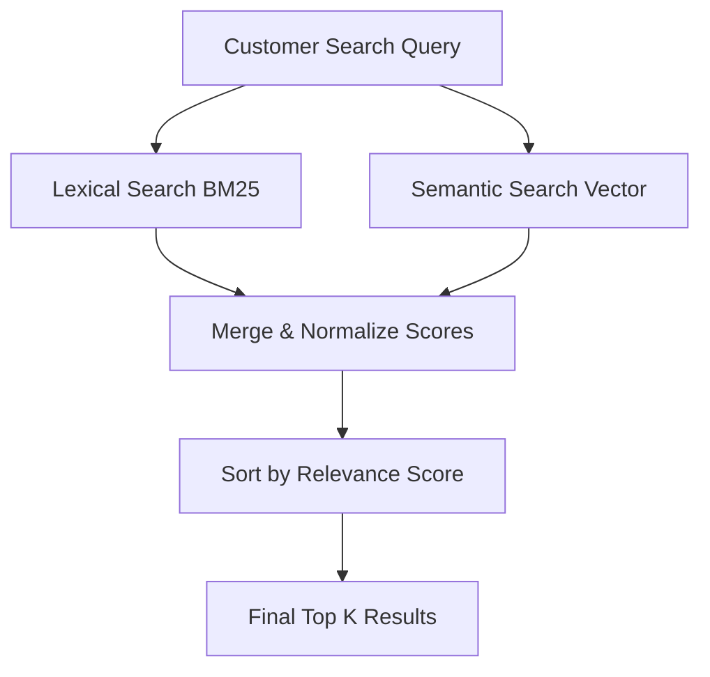

### CẢI THIỆN TÌM KIẾM LỊCH SỬ ĐƠN HÀNG BẰNG SEMANTIC SEARCH VỚI AMAZON OPENSEARCH SERVICE

Nếu bạn từng mua sắm trên Amazon, rất có thể bạn đã sử dụng trang Your Orders. Tính năng này lưu lại toàn bộ lịch sử đơn hàng của bạn từ năm 1995, cho phép bạn tìm kiếm, theo dõi và quản lý mọi lần mua trước đây. Tính năng tìm kiếm lịch sử đơn hàng giúp người dùng dễ dàng tìm lại các đơn hàng cũ bằng từ khóa. Không chỉ giúp tìm sản phẩm, nó còn hỗ trợ mua lại nhanh hơn, tiết kiệm thời gian và công sức.

Nhiều ứng dụng trong hệ sinh thái Amazon, chẳng hạn trợ lý mua sắm AI Rufus và trợ lý giọng nói Alexa, đều dựa vào tính năng tìm kiếm lịch sử đơn hàng để xác định các giao dịch mua trước đó. Vì vậy, hệ thống tìm kiếm này cần phải chính xác, trực quan và phản hồi nhanh.

Bài viết này giải thích cách nhóm Your Orders của Amazon cải thiện trải nghiệm tìm kiếm bằng cách bổ sung khả năng semantic search lên trên hệ thống lexical search hiện có, sử dụng Amazon OpenSearch Service và Amazon SageMaker.

### Hạn chế của Lexical Search

Theo cách truyền thống, tìm kiếm lịch sử đơn hàng dựa trên lexical matching, tức là đối sánh từ khóa. Cách này trả về các mặt hàng khớp với một hoặc nhiều từ tìm kiếm. Ví dụ, nếu khách hàng tìm kiếm "orange juice", hệ thống có thể trả về nước cam, cam tươi và các loại nước trái cây khác đã từng được đặt mua.

Mặc dù lexical search rất hiệu quả với các truy vấn khớp từ khóa chính xác, nó vẫn có những hạn chế đáng kể:

- Sai lệch từ đồng nghĩa và ngữ nghĩa: Hệ thống không xử lý tốt các từ khóa mang tính khái niệm hoặc tổng quát. Một truy vấn như "healthy drinks" sẽ không trả về "kombucha", "green tea" hay "protein shakes" nếu những cụm từ đó không xuất hiện đúng trong tiêu đề hoặc mô tả sản phẩm.
- Truy vấn hội thoại: Từ khi Rufus ra mắt, khách hàng ngày càng tìm kiếm bằng các câu hỏi theo ngữ cảnh và mục đích như "Show me the healthy drinks I bought last year". Để hỗ trợ kiểu truy vấn này, kho dữ liệu phía sau phải hiểu được ý nghĩa ngữ nghĩa của câu truy vấn, thay vì chỉ đối sánh từ đơn thuần.

### Thách thức kỹ thuật khi triển khai Semantic Search ở quy mô lớn

Việc tích hợp semantic search vào một hệ thống ở quy mô của Amazon đặt ra nhiều thách thức kỹ thuật lớn:

- Quy mô cực lớn: Hệ thống phải hỗ trợ semantic search trên hàng tỷ bản ghi đơn hàng của khách hàng toàn cầu.
- Không được gián đoạn: Hệ thống phải duy trì khả dụng 100% và tuân thủ nghiêm ngặt các SLA trong suốt quá trình di chuyển.
- Tránh làm giảm chất lượng tìm kiếm: Semantic search hữu ích cho truy vấn khái niệm, nhưng có thể làm giảm trải nghiệm với truy vấn chính xác. Ví dụ:
	- Nếu khách hàng tìm theo tên sản phẩm cụ thể, việc trả về thêm các sản phẩm chỉ "gần nghĩa" bên cạnh kết quả chính xác có thể làm nhiễu danh sách kết quả.
	- Semantic search không phù hợp với các truy vấn dùng định danh chặt chẽ như `orderId`, vì các giá trị này không mang ý nghĩa ngữ nghĩa. Trong các trường hợp đó, lexical search vẫn phải được giữ lại.

### Tổng quan kiến trúc giải pháp

Semantic search được hỗ trợ bởi các Large Language Model (LLM). Các mô hình này nhận đầu vào văn bản, chẳng hạn cụm từ tìm kiếm của khách hàng hoặc mô tả sản phẩm, rồi tạo ra một vector số có độ dài cố định gọi là embedding. Các vector embedding nắm bắt ý nghĩa ngữ nghĩa của văn bản: những văn bản có ý nghĩa gần nhau sẽ có độ tương đồng cosine cao giữa các vector tương ứng.

Giải pháp của Amazon được chia thành hai phần kiến trúc lớn:

- Khả năng chịu lỗi của hệ thống: Chuyển sang kiến trúc cell-based để xử lý khối lượng công việc vector tốn tài nguyên.
- Semantic pipeline: Xây dựng luồng tạo vector, lưu trữ và truy xuất vector.

**Hình 1. Sơ đồ kiến trúc cell-based cho thấy cách các yêu cầu của khách hàng được định tuyến tới các domain Amazon OpenSearch Service thông qua cơ chế phân vùng dựa trên hàm băm**

### Khả năng mở rộng và chịu lỗi: Kiến trúc Cell-Based

Để xử lý thêm tải tính toán do tìm kiếm vector gây ra, nhóm phát triển đã áp dụng kiến trúc cell-based. Mẫu kiến trúc này chia toàn bộ hệ thống thành các phần nhỏ, độc lập và đồng nhất, gọi là cell.

- Phân vùng khách hàng: Mỗi cell phục vụ một tập con khách hàng xác định. Các cell hoạt động độc lập và không cần giao tiếp với nhau.
- Cơ chế định tuyến: Yêu cầu của khách hàng được chuyển tới cell được gán cho họ tại thời điểm chạy. Thông tin gán có thể được tính động hoặc lấy từ cache/kho lưu trữ bền vững như Amazon DynamoDB. Cách này giúp cân bằng lại cell dễ dàng nếu một số cell trở nên "nặng" hơn các cell khác.
- Khả năng chịu lỗi: Nếu một cell gặp sự cố, chỉ một phần khách hàng, tương ứng $1/N$, bị ảnh hưởng thay vì toàn hệ thống ngừng hoạt động. Các khóa phân vùng cũng có thể được gán cho nhiều cell để ghi dữ liệu dự phòng và tránh mất dữ liệu.

### Triển khai Semantic Search

Việc triển khai các tính năng semantic search cốt lõi bao gồm một số quyết định và bước hạ tầng quan trọng:

**Hình 2. Luồng đọc và luồng ghi cho semantic search sử dụng Amazon OpenSearch Service và vector embedding từ Amazon SageMaker**

#### 1. Đánh giá và lựa chọn mô hình

Nhóm sử dụng một mô hình embedding được huấn luyện trên dữ liệu thương mại điện tử đặc thù của Amazon. Việc huấn luyện theo miền là rất quan trọng để mô hình hiểu được ngữ cảnh nghiệp vụ và các thuật ngữ sản phẩm.

Để chọn ra mô hình tốt nhất, họ áp dụng phương pháp LLM-as-a-Judge với Claude của Anthropic trên Amazon Bedrock. Claude chấm điểm và xếp hạng các mục đã được ẩn danh so với các cụm tìm kiếm, từ đó tạo ra bộ ground truth. Các mô hình được đánh giá bằng các chỉ số xếp hạng:

- Normalized Discounted Cumulative Gain (NDCG): Đo chất lượng xếp hạng.
- Mean Reciprocal Rank (MRR): Xem xét vị trí của mục liên quan đầu tiên.
- Precision và Recall: Đánh giá độ chính xác và mức độ đầy đủ.

#### 2. Triển khai hạ tầng

Mô hình embedding được chọn được đóng gói container, đăng ký lên Amazon Elastic Container Registry (Amazon ECR), sau đó triển khai bằng Amazon SageMaker Inference Endpoints để tính toán vector ở quy mô lớn.

#### 3. Lưu trữ vector và tìm kiếm với OpenSearch Service

Nhóm tận dụng hai tính năng chính của Amazon OpenSearch Service:

- Kiểu dữ liệu knn_vector: Hỗ trợ sẵn cho việc lưu trữ vector embedding. Vì số lượng bản ghi trên mỗi khách hàng tương đối nhỏ, họ sử dụng exact k-NN search thay vì approximate k-NN, cho phép hệ thống mở rộng mà không đánh đổi độ chính xác.
- Scripted Scoring: Các script Painless tính toán độ tương đồng vector ở phía máy chủ, giúp giảm độ phức tạp phía client và vẫn giữ được độ trễ thấp.

### Hybrid Search: Kết hợp sức mạnh của Lexical và Semantic

Để tận dụng ưu điểm của cả hai phương pháp, nhóm đã triển khai Hybrid Search. Khả năng hybrid query của OpenSearch Service chạy song song cả truy vấn lexical (BM25) và truy vấn semantic.

**Thực thi song song:** Cả hai truy vấn được chạy đồng thời.
**Chuẩn hóa điểm số:** OpenSearch chuẩn hóa và gộp điểm liên quan từ hai nguồn.
**Dự phòng cho định danh:** Trong những trường hợp semantic search không phù hợp, ví dụ tìm theo `orderId`, hệ thống chỉ dựa vào đối sánh từ khóa.
**Khả năng chịu lỗi:** Nếu đường semantic gặp lỗi tạm thời, truy vấn sẽ tự động quay về lexical-only search để đảm bảo khách hàng luôn nhận được kết quả.

### Backfilling: Xử lý dữ liệu lịch sử

Để semantic search thật sự hữu ích, dữ liệu đơn hàng lịch sử cần được cập nhật thêm vector embedding.  
Nhóm đã xây dựng một pipeline xử lý dữ liệu với:

**AWS Step Functions** để điều phối quy trình backfill.
**AWS Lambda** để xử lý các bản ghi cũ và gọi các endpoint **SageMaker** nhằm sinh vector embedding.

Hàng tỷ tài liệu đã được xử lý thành công với tốc độ nạp dữ liệu cao hơn nhiều lần mức thông thường, cho thấy độ bền và khả năng mở rộng của OpenSearch Service dưới tải nặng.

---

### Tác động tới nghiệp vụ và trải nghiệm khách hàng

Việc triển khai semantic search mang lại những cải thiện đáng kể về chất lượng tìm kiếm và chỉ số kinh doanh:

**Cải thiện trải nghiệm khách hàng:** Người dùng giờ có thể tìm các cụm như *"sustainable utensils"* và nhận được kết quả như thìa gỗ, hoặc tìm *"chargers"* và thấy bộ sạc cắm tường ngay cả khi từ *"charger"* không xuất hiện trong tiêu đề.
**Cải thiện 10% về Query Recall:** Tăng mức độ liên quan và tỷ lệ truy vấn trả về kết quả đúng.
**Cải thiện 20% về Query Success Rate:** Nhiều truy vấn hơn trả về ít nhất một mục liên quan.
**Tăng 48% độ bao phủ kết quả:** Semantic search đưa ra thêm các kết quả liên quan mà lexical search trước đó bỏ sót hoàn toàn.
**Tích hợp với Rufus và Alexa:** Hỗ trợ các trợ lý phía sau trả lời dễ dàng những truy vấn lịch sử phức tạp.

---

### Kết luận

Bằng cách phát triển hệ thống tìm kiếm lịch sử đơn hàng để hỗ trợ semantic capabilities, nhóm Amazon đã kết nối thành công các công nghệ AI hiện đại với hạ tầng kế thừa vững chắc ở quy mô lớn. Sử dụng **Amazon OpenSearch Service** và **Amazon SageMaker**, giải pháp vẫn duy trì SLA nghiêm ngặt và không gián đoạn trong khi xử lý hàng tỷ bản ghi khách hàng.

Để bắt đầu xây dựng ứng dụng semantic search của riêng bạn, bạn có thể tìm hiểu thêm về:
* Exact k-NN search trong OpenSearch
* Amazon OpenSearch Service Developer Guide

---
**Reference Link:** [https://www.facebook.com/share/p/191tDRSXB7/](https://www.facebook.com/share/p/191tDRSXB7/)