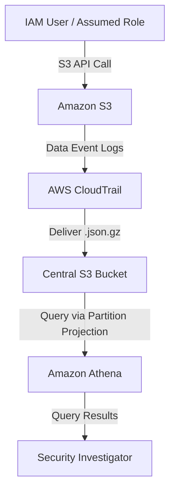

### GHI LOG VÀ PHÂN TÍCH TẬP TRUNG CÁC DATA EVENT CỦA S3 TRONG AWS CLOUDTRAIL

Khi xảy ra một sự cố bảo mật, chẳng hạn như truy cập trái phép hoặc xóa hàng loạt trong một S3 bucket, câu hỏi đầu tiên luôn là: "Ai đã làm việc này?" Các S3 server access log truyền thống cho biết yêu cầu nào đã xảy ra, nhưng không có đầy đủ ngữ cảnh danh tính IAM để xác định chính xác người dùng hoặc assumed role cụ thể.

Bài viết này, phần 2 trong chuỗi về S3 audit, trình bày cách triển khai một hệ thống audit dựa trên danh tính bằng AWS CloudTrail data events và Amazon Athena.


### S3 Data Events so với Server Access Logs

CloudTrail data events cung cấp khả năng theo dõi chi tiết ở cấp API cho các thao tác trên đối tượng S3 cùng với thông tin danh tính, bổ sung cho access log ở cấp HTTP.
- Nội dung được ghi nhận: Danh tính chi tiết của IAM user/role, các API operation như GetObject, PutObject, DeleteObject, ngữ cảnh xác thực như MFA và chuỗi assumed role, cùng thông tin truy cập liên tài khoản.

- Nội dung không được ghi nhận: Các chỉ số hiệu năng ở cấp HTTP, status code hoặc thời gian phản hồi chính xác, những thông tin này yêu cầu S3 server access logs như đã nói ở phần 1.

- Cách phân phối và chi phí: Log được phân phối dưới dạng JSON nén trong khoảng 5 phút. Chi phí là 0,10 USD cho mỗi 100.000 data event được ghi nhận. Lưu ý rằng data event không có free tier.

### Cấu hình từng bước

Để thiết lập hệ thống ghi log audit tập trung cho S3 trên toàn tổ chức:
1. Tạo CloudTrail Trail: Trong CloudTrail console, tạo một trail mới, ví dụ `s3-data-events-trail`, và chọn một S3 bucket tập trung làm nơi lưu trữ.

2. Bật ghi log trên toàn tổ chức: Nếu dùng AWS Organizations, chọn Enable for all accounts in my organization trong management account để tự động triển khai trail tới tất cả member account.

3. Cấu hình Advanced Event Selectors: Bỏ chọn management events để tránh phát sinh chi phí ghi log trùng lặp nếu đã có trail khác, sau đó chọn Data Events với S3 là loại tài nguyên. Bạn có thể lọc theo bucket hoặc prefix.

4. Cấu hình S3 Lifecycle Policy: Trên bucket trung tâm, thiết lập lifecycle rule để chuyển log sang Standard-IA sau 90 ngày, Glacier sau 180 ngày và hết hạn sau 7 năm nhằm giảm chi phí lưu trữ.

### Tạo bảng Athena với Partition Projection

Partition projection tính toán giá trị partition một cách động từ đường dẫn S3, giúp tăng tốc truy vấn và giảm chi phí quét metadata. Hãy dùng truy vấn dưới đây để tạo bảng:
```sql
CREATE EXTERNAL TABLE cloudtrail_s3_events (
	eventversion STRING,
	useridentity STRUCT<
		type: STRING, principalid: STRING, arn: STRING, accountid: STRING,
		username: STRING, sessioncontext: STRUCT<
			attributes: STRUCT<mfaauthenticated: STRING, creationdate: STRING>,
			sessionissuer: STRUCT<arn: STRING, accountid: STRING, username: STRING>
		>
	>,
	eventtime STRING, eventsource STRING, eventname STRING, awsregion STRING,
	sourceipaddress STRING, useragent STRING, errorcode STRING, errormessage STRING,
	requestparameters STRING, responseelements STRING, additionaleventdata STRING,
	recipientaccountid STRING, sharedEventId STRING
)
PARTITIONED BY (
	account STRING,
	region STRING,
	`timestamp` STRING 
)
ROW FORMAT SERDE 'org.apache.hive.hcatalog.data.JsonSerDe'
STORED AS INPUTFORMAT 'com.amazon.emr.cloudtrail.CloudTrailInputFormat'
OUTPUTFORMAT 'org.apache.hadoop.hive.ql.io.HiveIgnoreKeyTextOutputFormat'
LOCATION 's3://centralized-s3-cloudtrail-logs/AWSLogs/'
TBLPROPERTIES (
	'projection.enabled' = 'true',
	'projection.account.type' = 'injected',
	'projection.region.type' = 'injected',
	'projection.timestamp.type' = 'date',
	'projection.timestamp.format' = 'yyyy/MM/dd',
	'projection.timestamp.range' = '2024/01/01,NOW',
	'projection.timestamp.interval' = '1',
	'projection.timestamp.interval.unit' = 'DAYS', 
	'storage.location.template' = 's3://centralized-s3-cloudtrail-logs/AWSLogs/${account}/CloudTrail/${region}/${timestamp}/'
);
```
Lưu ý: Với trail trên toàn tổ chức, hãy thêm `organization_id STRING` làm cột partition đầu tiên và chèn nó vào `storage.location.template`.

### Các mẫu truy vấn bảo mật quan trọng

Athena partition projection yêu cầu chỉ định `account`, `region` và `timestamp` trong mệnh đề `WHERE` của mọi truy vấn để cắt tỉa partition và tránh các lần quét toàn bảng có chi phí cao.
1. Theo dõi hoạt động của người dùng cụ thể

Xác định các hành động ở data plane của S3 do một IAM user hoặc role thực hiện trong một ngày cụ thể:

```sql
SELECT eventtime, useridentity.arn as user_arn, eventname, sourceipaddress,
			 JSON_EXTRACT_SCALAR(requestparameters, '$.bucketName') as bucket,
			 JSON_EXTRACT_SCALAR(requestparameters, '$.key') as object_key
FROM cloudtrail_s3_events
WHERE account = '123456789012' AND region = 'us-east-1' AND timestamp = '2026/05/15'
	AND (useridentity.username = 'specific-user' OR useridentity.arn LIKE '%specific-user%')
	AND eventname IN ('GetObject', 'PutObject', 'DeleteObject')
ORDER BY eventtime DESC;
```
2. Giám sát truy cập liên tài khoản

Đánh dấu các thao tác S3 bắt nguồn từ các AWS account bên ngoài:
```sql
SELECT eventtime, useridentity.accountid as source_account, recipientaccountid as target_account,
			 useridentity.arn as user_arn, eventname, sourceipaddress
FROM cloudtrail_s3_events
WHERE account = '123456789012' AND region = 'us-east-1' AND timestamp = '2026/05/15'
	AND useridentity.accountid != recipientaccountid
ORDER BY eventtime DESC;
```
3. Hiển thị các lần truy cập thất bại

Phát hiện các lỗi quyền như AccessDenied hoặc NoSuchKey, từ đó làm nổi bật các hành vi có thể là dò quét hoặc brute-force:
```sql
SELECT eventtime, useridentity.arn as user_arn, eventname, sourceipaddress, errorcode, errormessage
FROM cloudtrail_s3_events
WHERE account = '123456789012' AND region = 'us-east-1' AND timestamp = '2026/05/15'
	AND errorcode IS NOT NULL
ORDER BY eventtime DESC LIMIT 100;
```
4. Audit các thao tác xóa

Kiểm tra các lần xóa đối tượng theo khoảng ngày, bao gồm assumed role và trạng thái MFA:
```sql
SELECT eventtime, useridentity.arn as user_arn, sourceipaddress,
			 JSON_EXTRACT_SCALAR(requestparameters, '$.bucketName') as bucket,
			 JSON_EXTRACT_SCALAR(requestparameters, '$.key') as deleted_object,
			 useridentity.sessioncontext.attributes.mfaauthenticated as mfa_used
FROM cloudtrail_s3_events
WHERE account = '123456789012' AND region = 'us-east-1'
	AND timestamp BETWEEN '2026/05/15' AND '2026/05/17'
	AND eventname IN ('DeleteObject', 'DeleteObjects')
ORDER BY eventtime DESC;
```
### Best practices và xử lý sự cố
- Partition Pruning là yếu tố then chốt: Luôn lọc trước theo các cột partition là `account`, `region`, `timestamp`. Chỉ dùng `eventtime` sẽ dẫn tới quét toàn bộ bảng và làm tăng chi phí.

- Loại trừ HeadObject: Nếu bạn thấy chi phí tăng cao do các thao tác metadata, hãy cấu hình CloudTrail event selectors để loại trừ API HeadObject.

- Tính toàn vẹn và bảo mật: Bật log file validation để đảm bảo log không bị chỉnh sửa. Để đạt bảo mật tối đa, hãy cô lập log trong một AWS log-archive account chuyên dụng.

- HIVE_PARTITION_SCHEMA_MISMATCH: Nếu gặp lỗi này, hãy kiểm tra xem `storage.location.template` có khớp với cấu trúc đường dẫn S3 thực tế hay không.

### Kết luận
Việc tập trung hóa S3 data events thông qua CloudTrail cung cấp ngữ cảnh danh tính quan trọng cho các yêu cầu bảo mật và tuân thủ. Khi kết hợp với Athena partition projection, bạn có thể tiến hành điều tra bảo mật hiệu quả về chi phí trên hàng triệu hành động.

---
**Reference Link:** [https://www.facebook.com/share/p/1UDZGdgAx6/](https://www.facebook.com/share/p/1UDZGdgAx6/?)